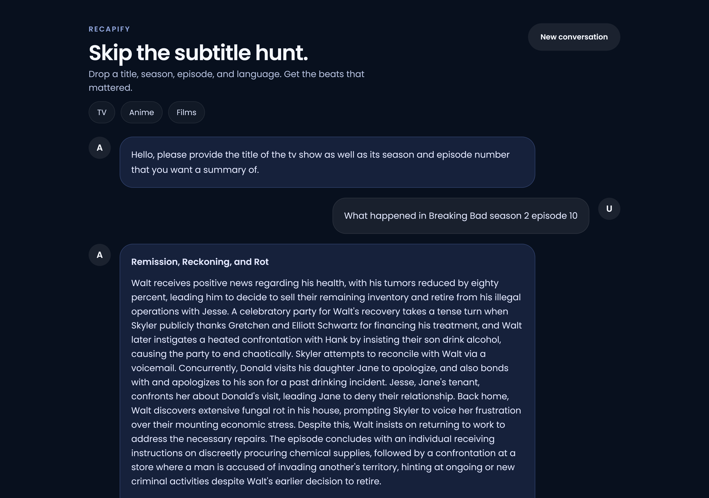
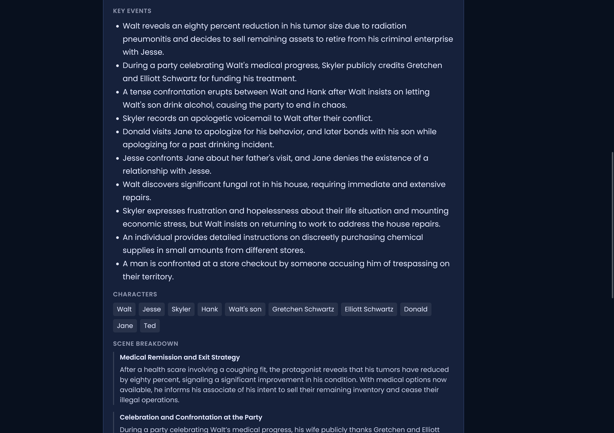
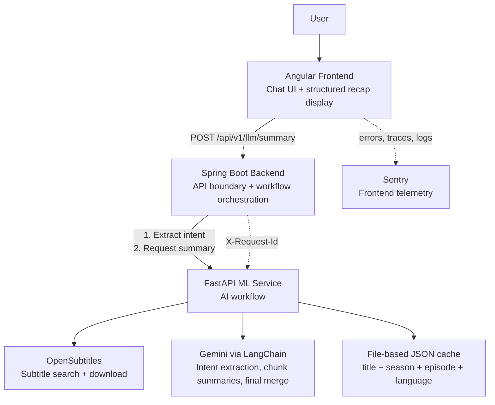

# Recapify

[](https://github.com/beytuuh42/recapify/actions/workflows/ci.yml)

Recapify is a full-stack AI application that generates concise episode recaps from natural-language requests.

Type something like:

```text
summarize Breaking Bad season 1 episode 9
```

Recapify extracts the media intent, finds subtitle data, summarizes the transcript with Gemini, and returns a readable recap in a chat-style interface.

## Live Demo

https://recapify.dev

The demo runs on a Docker-enabled AWS EC2 instance behind Caddy-managed HTTPS. The public domain terminates TLS at Caddy, which forwards traffic to the frontend container; backend and ML services stay private on the Docker network.

## Preview



<details>
<summary>Show structured recap details</summary>



</details>

## Why I Built This

Episode recaps are useful, but they are often scattered across websites, inconsistent in quality, or hard to find for a specific season and episode. Recapify explores a more direct workflow: ask for the exact episode you care about and receive a focused summary generated from subtitle data.

## What It Does

- Accepts natural-language requests such as `summarize Breaking Bad season 1 episode 9`.
- Extracts structured media intent from free text: title, season, episode, media type, and language.
- Searches for matching subtitle data through OpenSubtitles.
- Cleans SRT content and splits transcripts into manageable chunks.
- Generates chunk-level summaries with Gemini.
- Merges chunk summaries into one coherent episode recap.
- Caches generated summaries by title, season, episode, and language.
- Returns the result through an Angular chat UI.

## Engineering Highlights

- Built as a three-service system with Angular, Spring Boot, and FastAPI.
- Uses Spring Boot as the API boundary between the browser and the ML workflow.
- Keeps the ML workflow isolated in FastAPI: intent extraction, subtitle retrieval, transcript chunking, LLM summarization, summary merging, and caching.
- Uses LangChain and LangSmith prompt references for structured LLM workflows.
- Uses typed request and response models across the backend and ML service.
- Adds request correlation with propagated `X-Request-Id` values across backend and ML logs.
- Adds frontend observability through Sentry and local browser debugging through Playwright.
- Runs locally with Docker Compose hot reload across all services.
- Deploys to AWS EC2 with a single public HTTPS entry point, same-origin API routing, DNS, TLS, and private backend/ML containers.

## Architecture



<details>
<summary>Show detailed workflow</summary>



</details>

```mermaid
flowchart LR
    user[User] --> frontend[Angular frontend<br/>Chat UI]

    frontend -->|POST /api/v1/llm/summary<br/>Natural-language request| backendController[Spring Boot backend<br/>LlmController]

    backendController --> backendService[LlmService<br/>Workflow orchestration]

    backendService -->|1. Extract intent| backendClient[MlServiceClient<br/>WebClient boundary]
    backendClient -->|POST /api/v1/intent<br/>X-Request-Id propagated| mlIntent[FastAPI ML service<br/>Intent extraction]

    mlIntent --> langsmithIntent[LangSmith prompt<br/>extract_intent]
    langsmithIntent --> geminiIntent[Gemini via LangChain<br/>Structured intent output]

    geminiIntent --> backendClient

    backendService -->|2. Generate summary| backendClient
    backendClient -->|POST /api/v1/summarize<br/>Structured SummaryRequest| mlSummary[FastAPI ML service<br/>Summary workflow]

    mlSummary --> cacheRead[File-based JSON cache<br/>title + season + episode + language]

    cacheRead -->|Cache hit| cachedSummary[Cached EpisodeSummary]
    cacheRead -->|Cache miss| subtitles2[OpenSubtitles<br/>Subtitle search + download]

    subtitles2 --> transcript[Transcript processing<br/>Clean SRT + chunk text]
    transcript --> langsmithChunk[LangSmith prompt<br/>summarize_chunk]
    langsmithChunk --> geminiChunk[Gemini via LangChain<br/>Batched chunk summaries]

    geminiChunk --> langsmithMerge[LangSmith prompt<br/>merge_episode_summary]
    langsmithMerge --> geminiMerge[Gemini via LangChain<br/>Final structured EpisodeSummary]

    geminiMerge --> cacheWrite[Write JSON cache]
    cacheWrite --> mlSummary
    cachedSummary --> mlSummary

    mlSummary -->|EpisodeSummary JSON| backendClient
    backendClient --> backendService
    backendService --> backendController
    backendController -->|Structured JSON response| frontend

    frontend --> recap[Chat-style recap display<br/>final summary, key events, characters, scenes]

    frontend -. errors, traces, logs .-> sentry2[Sentry<br/>Frontend telemetry]
    backendController -. request logs .-> backendLogs[Backend logs<br/>MDC request correlation]
    backendClient -. outbound ML logs .-> backendLogs
    mlSummary -. request logs .-> mlLogs[ML service logs<br/>X-Request-Id correlation]
```

## Design Decisions

Recapify uses a three-service architecture to keep responsibilities separate: Angular handles the chat UI, Spring Boot provides the browser-facing API boundary, and FastAPI contains the AI workflow.

The Spring Boot layer coordinates requests, propagates request IDs, and maps ML-service errors into user-facing responses. The FastAPI service handles AI-specific work such as intent extraction, subtitle retrieval, transcript chunking, LLM summarization, summary merging, and caching.

This keeps the Java backend close to a typical enterprise API layer while allowing the Python service to use AI-focused tooling such as FastAPI, Pydantic, LangChain, LangSmith, and OpenSubtitles directly.

## Tech Stack

| Area | Technology |
|---|---|
| Frontend | Angular 19, Signals, RxJS, Sentry, Playwright |
| Backend | Java 21, Spring Boot 4, WebClient, Lombok |
| ML service | Python 3.12, FastAPI, Pydantic, LangChain, LangSmith, Gemini |
| External APIs | OpenSubtitles, Google Gemini |
| Runtime | Docker, Docker Compose, Nginx, Caddy |
| Cloud and deployment | AWS EC2, Linux, DNS, HTTPS/TLS, reverse proxy, containerized services |
| Observability | Sentry frontend telemetry, request IDs, structured service logs |

## Demo Flow

1. The user enters a request in the chat UI.
2. The frontend sends the raw text to the backend.
3. The backend creates a request ID and forwards the work to the ML service.
4. The ML service extracts structured intent from the request.
5. The ML service finds and downloads subtitles for the requested episode.
6. The transcript is cleaned, chunked, summarized, and merged.
7. The final recap is returned to the frontend and revealed in the chat.

## Running Locally

Prerequisites:

- Docker Desktop
- Git
- Google API key
- OpenSubtitles API credentials
- LangSmith access for prompt loading and tracing workflows

Create the ML environment file:

```bash
cp ml/.env.example ml/.env
```

Fill in:

```text
GOOGLE_API_KEY=...
OPEN_SUBTITLES_API_KEY=...
OPEN_SUBTITLES_USER=...
OPEN_SUBTITLES_PASSWORD=...
LANGSMITH_API_KEY=...
LANGSMITH_ENDPOINT=https://eu.api.smith.langchain.com
LANGSMITH_TRACING=true
```

Start the full development stack:

```bash
docker compose --profile dev watch
```

Open the frontend:

```text
http://localhost:4200
```

Development ports:

| Service | URL |
|---|---|
| Frontend | http://localhost:4200 |
| Backend | http://localhost:8081 |
| ML service | http://localhost:8000 |
| ML API docs | http://localhost:8000/docs |

## Production Deployment

The production Compose profile runs frontend, backend, and ML containers for a single Docker-enabled EC2 instance. Caddy is the public HTTPS entry point for `recapify.dev` and forwards traffic to the frontend container on localhost. The frontend Nginx container serves the Angular app and proxies `/api/v1/` requests to the backend on the internal Docker network.

```text
Browser -> https://recapify.dev -> Caddy -> frontend-prod Nginx -> backend-prod -> ml-prod
```

Only ports `80` and `443` are public. The Docker frontend port is bound to localhost for Caddy, while backend and ML services remain internal-only.

See [EC2 production deployment](docs/ec2-production-deployment.md) for setup, secrets, security group ports, smoke checks, logs, rollback, and TLS notes.

## Testing

Run the focused unit tests from each service directory:

```bash
cd frontend && npm test
cd backend/recapify && ./mvnw test
cd ml && python -m unittest discover -s tests
```

The frontend suite runs on Vitest, the backend suite uses JUnit, and the ML service uses standard-library `unittest`.

## Observability and Debugging

Frontend events, errors, traces, and logs are sent to Sentry when a Sentry DSN is configured. In local development, browser console output is also useful for inspecting the frontend flow.

Backend and ML logs are written to stdout, so they are visible through Docker logs:

```bash
docker logs --tail 200 recapify-backend-dev
docker logs --tail 200 recapify-ml-dev
```

Requests through the backend receive an `X-Request-Id`. The same ID is propagated to the ML service, which makes it possible to follow one summary request across service logs.

The frontend also includes a Playwright-based debug script:

```bash
cd frontend
npm run debug:frontend
npm run debug:frontend -- "summarize Breaking Bad season 1 episode 1"
```

It captures browser console messages, page errors, failed requests, and HTTP errors from a running local frontend.

## Configuration

Frontend production builds generate `src/environments/environment.ts` from environment variables in `frontend/set-env.js`.

| Variable | Purpose | Default |
|---|---|---|
| `API_URL` | Backend base URL used by the frontend production build | `http://localhost:8080/` |
| `SENTRY_DSN` | Enables Sentry telemetry in the frontend | empty |
| `SENTRY_ENVIRONMENT` | Sentry environment name | `production` |
| `LLM_SERVICE_BASEURL` | Backend-to-ML service URL | `http://localhost:8000` |

In Docker Compose production, the frontend image is built with same-origin API access:

```text
FRONTEND_API_URL=/
```

The frontend Nginx container proxies `/api/v1/` to the backend container, and the backend points to the ML container with:

```text
LLM_SERVICE_BASEURL=http://ml-prod:8000
```

In Docker Compose development, the backend points to the ML container with:

```text
LLM_SERVICE_BASEURL=http://ml-dev:8000
```

## Current Limitations and Next Steps

- The hosted demo currently runs on a manually operated EC2 instance rather than a managed deployment pipeline.
- Subtitle availability and quality depend on OpenSubtitles results.
- The backend currently acts mainly as an API boundary and service orchestration layer.
- Focused unit tests now exist for all three services, but broader end-to-end coverage is still limited.
- Possible next improvements include clearer progress feedback during long-running summary generation, broader end-to-end coverage, and more durable storage for cached summaries.

## Project Structure

```text
recapify/
|-- frontend/              Angular chat UI
|-- backend/recapify/      Spring Boot API service
|-- ml/                    FastAPI ML service
|   `-- app/               ML service source
`-- docker-compose.yml     Dev and production container profiles
```
